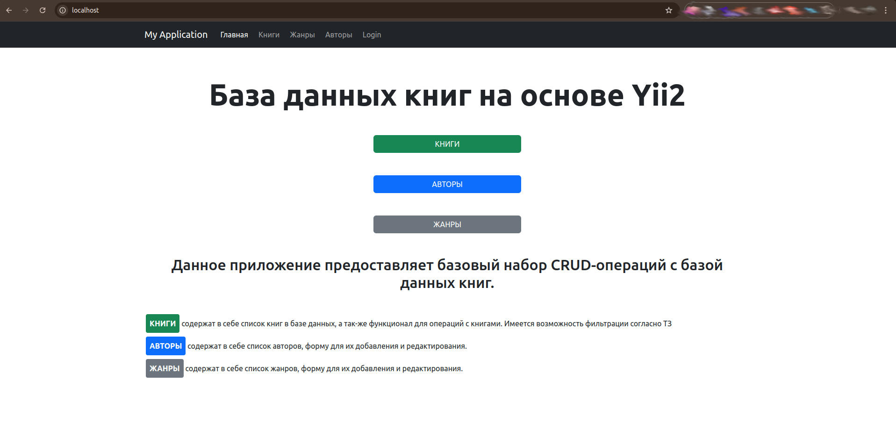
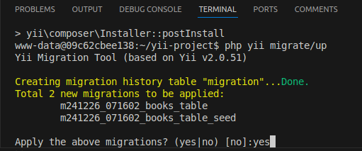
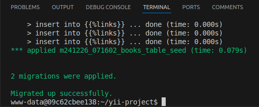
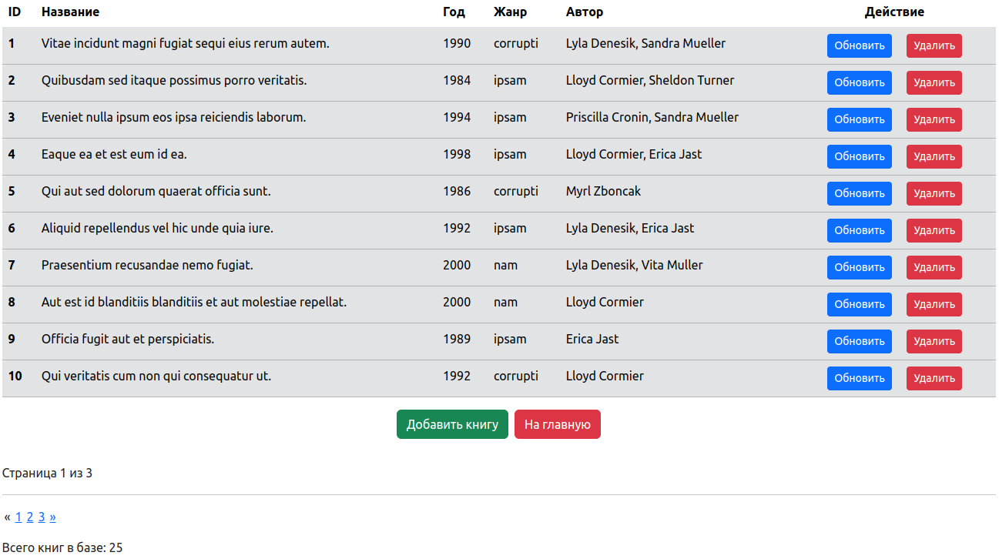
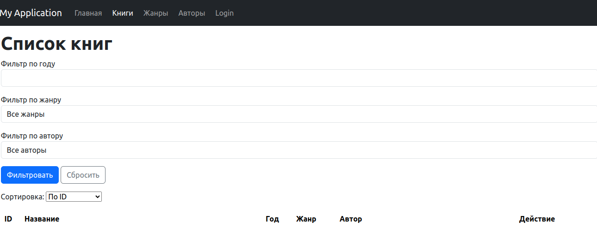
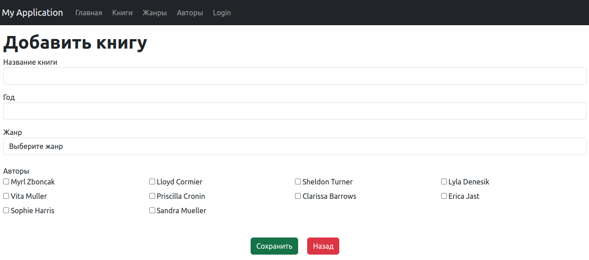
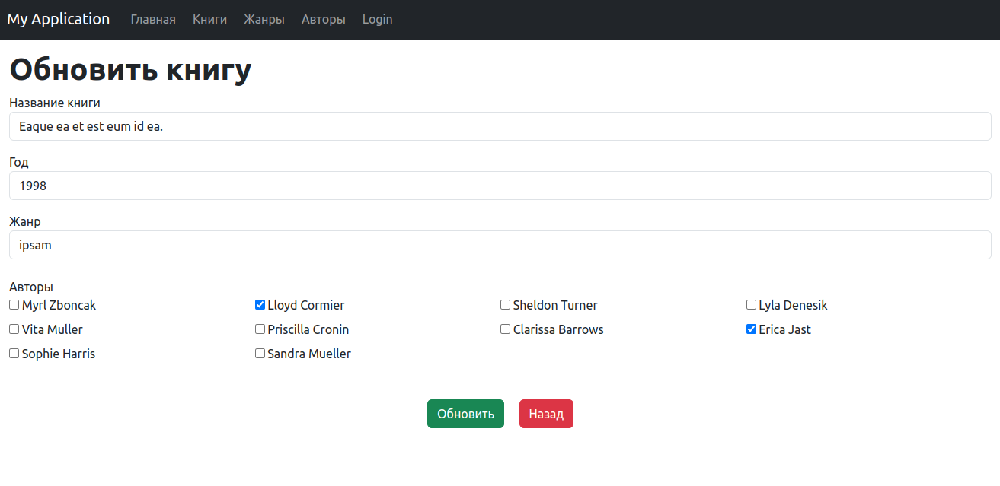
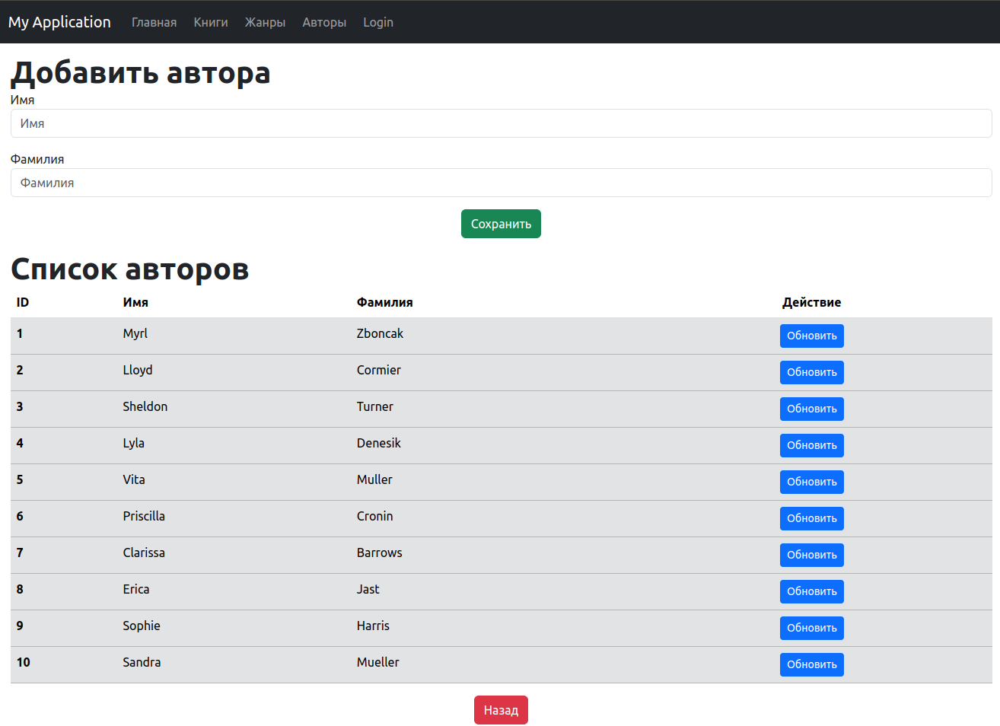
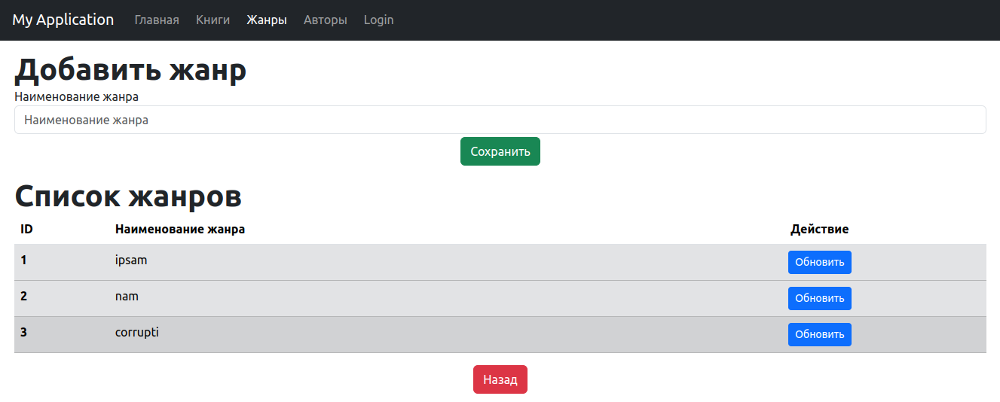

# Yii Library

Данный контейнер содержит в себе приложение, позволяющее проводить CRUD-операции с базой данных книг.
Приложение запускается в докер-контейнере и имеет пошаговую инструкцию.

Проект так-же оснащен PHPMyAdmin для удобного просмотра архитектуры БД (после установки зависимостей будет находиться по адресу ```http://localhost:8080```).

## 0. Подготовка
Находясь в папке, в которую Вы хотите скачать проект, клонируем репозиторий с помощью команды:

```git clone git@github.com:Longin89/YiiLibrary.git```

После этого, переходим в папку проекта:

```cd YiiLibrary-main```

## 1. Установка
Для начала нужно скачать все необходимое для контейнера командой:

```docker-compose build```

После этого запустить сервисы с помощью:

```docker-compose up -d```

Затем зайти в консоль контейнера:

```docker exec -it yii_php bash```

В папку проекта:

```cd yii-project``` 

Чтобы установить зависимости командой:

```composer install```

После завершения установки в браузерной строке нужно перейти по адресу:

http://localhost

Чтобы убедиться, что все зависимости установлены



#### Внимание: если страница Yii не отображается - проверьте наличие полных прав на папку проекта и обновите страницу.
В Ubuntu, например, самый простой способ это сделать - ввести команду:

```sudo chmod -R 777 '/папка_проекта/'```

Стоит заметить, что после этого приложение еще не готово к работе, т.к. не проведена миграция БД.

## 2. Миграция базы данных и сидирование
В проект интегрирована миграция базы данных, а так-же сидеры для ее наполнения, чтобы запустить их - введите команду и подтвердите миграцию:

```php yii migrate/up```



После завершения процесса миграции будет выведено соответствующее сообщение:



После этого приложение готово к работе.

## 3.1 Книги (таблица)

Таблица книг содержит информацию о ID, названии, годе выпуска, авторе(ах), жанре, а так-же имеет кнопки удаления книги или обновления ее данных. 



Согласно ТЗ имеется пагинация - 10 книг на страницу.

Помимо этого здесь-же присутствует фильтрация и сортировка по ID(по умолчанию), названию и году издания.



Отфильтрованные книги могут по необходимости сортироваться в нужном порядке.
Кнопка ```Сбросить``` приводит таблицу к первоначальному виду.

## 3.2 Книги (добавление)



При нажатии на кнопку ```Добавить книгу``` открывается страница с соответствующей формой.
Все поля обязательны для заполнения. Жанр и авторы загружаются непосредственно из бд, поэтому доступны в виде выпадающего списка и чекбоксов.
После добавления книги в бд будет выведено соответствующее сообщение.
Проверить наличие новой книги можно в таблице, на счетчике общего количества книг или в PHPMyAdmin.


## 3.3 Книги (обновление)

При нажатии на кнопку ```Обновить``` открывается страница с формой и загруженной информацией о книге.



Действия аналогичны созданию новой книги. После обновления будет выведено соответствующее сообщение.


## 3.4 Книги (удаление)

При нажатии кнопки ```Удалить``` будет запрошено подтверждение действия:


После которого будет выведено соответствующее подтверждение:


## 4. Авторы



Функционал по добавлению авторов представляет собой упрощенную вариацию добавления книг.

## 4. Жанры

Функционал по добавлению жанров так-же представляет собой упрощенную вариацию добавления книг.

